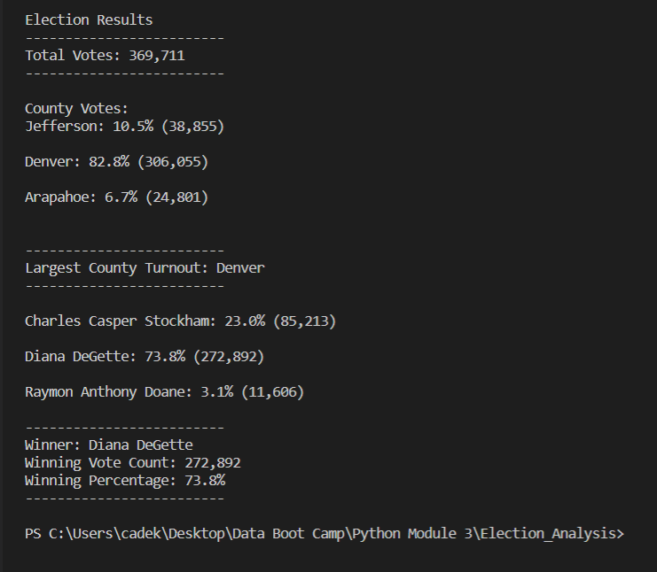

# Module 3 Challenge: PyPoll With Python
## Overview of Election Audit
The purpose of this challenge is to automate the election results, and present to the Colorado Board of Elections a finished product. Creating this within python will allow votes to be pulled from all counties within Colorado creating a fast and efficient election process.
## Election Audit Results

* Total Votes: 369,711
---
* Jefferson: 10.5% (38,855)
* Denver: 82.8% (360,055)
* Arapahoe: 6.7% (24,801)
---
* Largest County Turnout: Denver
---
* Charles Casper Stockham: 23.0% (85,213)
* Diana DeGette: 73.8% (272,892)
* Raymon Anthony Doane: 3.1% (11,606)
---
* Winner: Diana DeGette
* Winning Vote Count: 272,892
* Winning Percentage: 73.8%
## Election Audit Summary
As you can see utilizing the programing of python the election process within Colorado could be automated and made more effcient. For a state wide election if the rest of the votes with the rest of the counties were added to the results file the code would produce the desired results. Also, this code could be modified to be used for primary elections, allowing the candidates a sneak peek as to how they are perfoming in certain counties. With this knowledge they could focus their efforts on counties they lacking in.
